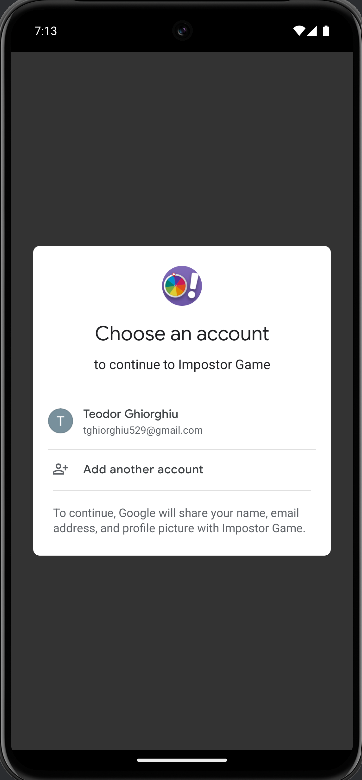
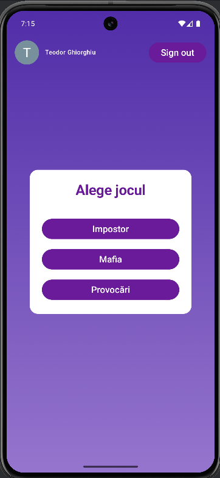
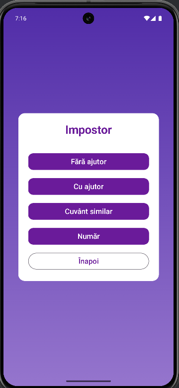
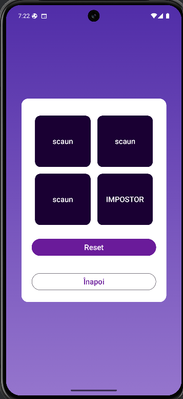
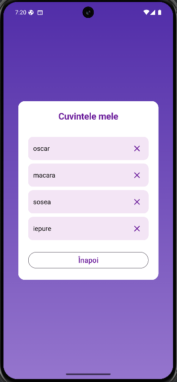
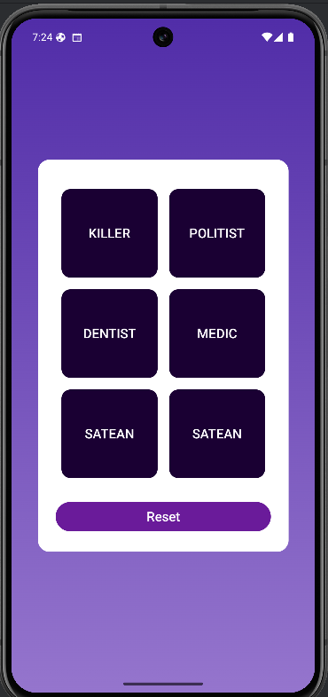
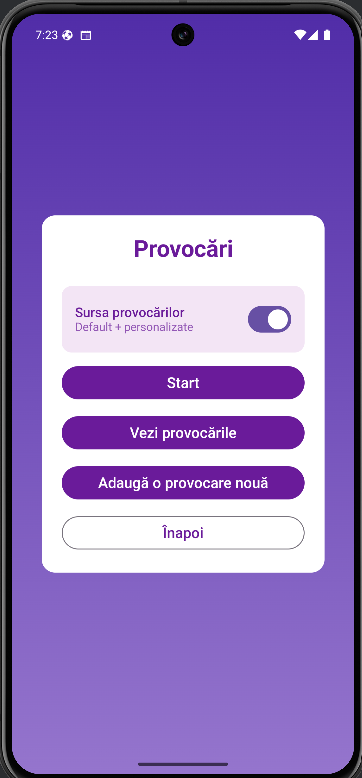
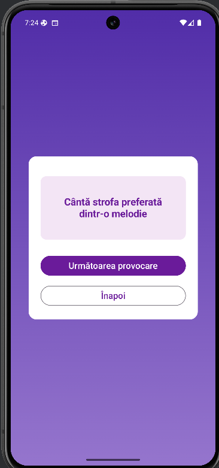

# 🎉 Party Games Collection - Android App

A modern Android party game application built with Kotlin and Jetpack Compose, featuring three interactive games with customizable word lists and Firebase integration.

##  Features

### 🎮 Three Game Modes

1. **Impostor** - A social deduction game with multiple variants:
   - **No Hints Mode** - All players receive the same word, except the impostor who sees "IMPOSTOR"
   - **With Hints Mode** - Players get a word with a category hint, impostor only sees the hint
   - **Similar Words Mode** - Players receive the main word, impostor gets a synonym
   - **Numbers Mode** - Number-based variant where players must identify the impostor

2. **Mafia** - Classic Mafia/Werewolf role assignment game:
   - Dynamic role distribution based on player count (4-15 players)
   - Roles: Killer, Medic, Police, Dentist, Villagers
   - Hidden role reveal mechanism - tap to reveal, tap again to hide from other players

3. **Challenges** - Truth or Dare style party game:
   - Random challenge selection
   - Custom challenge creation
   - No challenge repetition until all have been shown

---

### 🔐 Authentication

- Google Sign-In integration via Firebase Authentication
- Persistent user sessions
- User profile display with photo and name

---

### 💾 Data Management

- **Firebase Firestore** for cloud storage
- **Custom word lists** - Users can create personalized word collections
- **Dual word sources**:
  - Default word repository for immediate gameplay
  - User-created custom words stored in Firebase
- **CRUD operations** for user words:
  - Add new words with optional hints
  - View all custom words
  - Delete unwanted words

---

###  UI/UX

- Modern Material 3 design system
- Responsive layouts with Jetpack Compose
- Loading states and error handling

---

##  Technical Architecture

### Technologies Used

- **Language**: Kotlin
- **UI Framework**: Jetpack Compose
- **Architecture**: MVVM (Model-View-ViewModel)
- **Backend**: Firebase (Authentication + Firestore)
- **Async Operations**: Kotlin Coroutines
- **State Management**: StateFlow & Compose State
- **Image Loading**: Coil

---

## 🔧 Extensible Architecture

The application is designed with extensibility and maintainability as core principles.

### Modular Game System

- Each game (Impostor, Mafia, Challenges) is isolated in its own class with a clean interface
- A new game can be added by creating a new game logic class and corresponding Activity, without modifying existing game logic
- Game rules are separated from UI, allowing modifications without affecting the presentation layer

### Scalable Data Layer

- Repository pattern implemented via `WordRepository` and `UserWordsRepository`
- GameMode enum structure allows easy addition of new game variants
- Data source abstraction makes it possible to switch between local and remote storage without rewriting game logic

### Clean Separation of Concerns

- Clear separation between UI layer, game logic layer, and data layer
- Reusable composable UI components (ButtonS, SecondaryButton, ModeButton)
- Centralized theme system for consistent styling

---

## 🎯 How to Use

### First Time Setup

1. Launch the app
2. Sign in with your Google account
3. Grant necessary permissions

### Playing Impostor

1. Select "Impostor" from the main menu
2. Choose a game mode (No Hints, With Hints, Similar Words, or Numbers)
3. Toggle between default and custom words (if available)
4. Enter the number of players (3-10)
5. Optionally add custom words to your collection
6. Tap "Start" to begin
7. Each player taps their cell to reveal their word, then taps again to hide it from other players
8. Find the impostor through discussion

### Playing Mafia

1. Select "Mafia" from the main menu
2. Enter the number of players (4-15)
3. Each player taps their cell to see their role
4. Play continues according to Mafia rules

### Playing Challenges

1. Select "Challenges" from the main menu
2. Toggle between default and custom challenges
3. Add your own challenges if desired
4. Tap "Start" to begin
5. Tap "Next Challenge" to get a new random challenge
6. Complete the challenge or pass

---

### Authentication

### Main Menu

### Impostor Menu

### Impostor - No Hints Mode Menu

### Impostor - No Hints Gameplay

### Impostor - Add Custom Word

### Impostor - Custom Word List

### Mafia Gameplay

### Challenges Menu

### Challenges Gameplay

